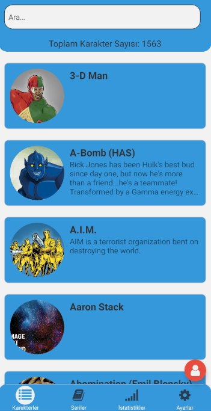
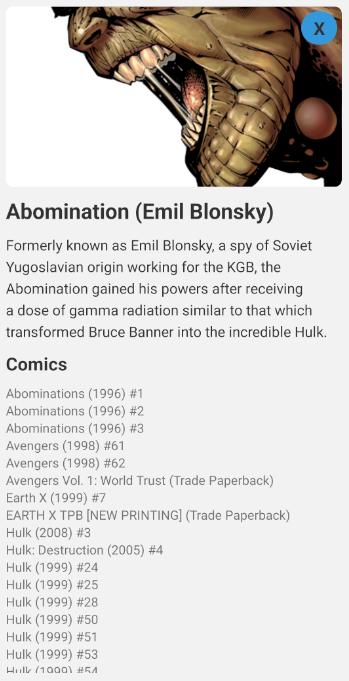
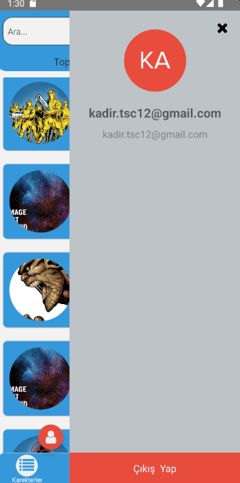
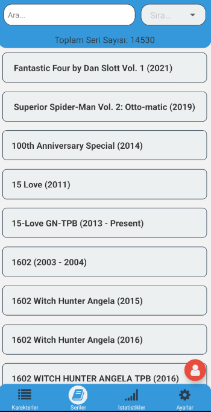
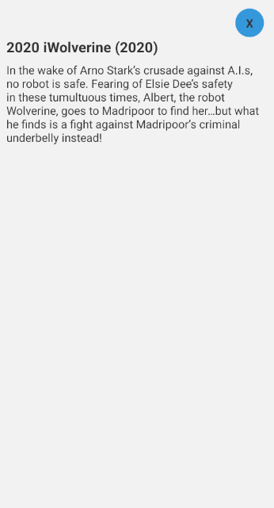
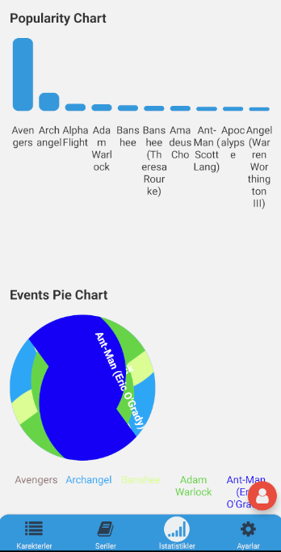

This is a new [**React Native**](https://reactnative.dev) project, bootstrapped using [`@react-native-community/cli`](https://github.com/react-native-community/cli).

# Projenin Amacı

Bu proje, React Native kullanılarak geliştirilmiş bir mobil uygulamadır. Auth0 kimlik doğrulama servisi kullanılarak kullanıcı girişi sağlanmış ve [Marvel Developer API](https://developer.marvel.com/) kullanılarak kahraman bilgileri alınmıştır.

## Nasıl kurulur/çalıştırılır (Bağımlılıklar)

Öncelikle, React Native ile birlikte gönderilen JavaScript _bundler_ olan **Metro**'yu başlatmanız gerekecek.

Metro'yu başlatmak için React Native projenizin _root_ dizininden aşağıdaki komutu çalıştırın:

```bash
# using npm
npm start

# OR using Yarn
yarn start
```

Metro Bundler'ın kendi terminalinde çalışmasına izin verin. React Native projenizin _root_ dizininden bir yeni terminali açın. _Android_ veya _iOS_ uygulamanızı başlatmak için aşağıdaki komutu çalıştırın:
### For Android

```bash
# using npm
npm run android

# OR using Yarn
yarn android
```

### For iOS

```bash
# using npm
npm run ios

# OR using Yarn
yarn ios
```
Bu, uygulamanızı çalıştırmanın bir yoludur; uygulamayı doğrudan sırasıyla Android Studio ve Xcode içinden de çalıştırabilirsiniz.


# Bağımlılıklar 

Splash Screen
```bash
npm i react-native-splash-screen
```
manage.auth0
```bash
npm install react-native-auth0 --save
```
react-navigation
```bash
npm install @react-navigation/native
npm install react-native-screens react-native-safe-area-context
npm install @react-navigation/native-stack
npm install react-navigation/bottom-tabs
```

redux
```bash
npm install redux
npm install redux-thunk
npm install @reduxjs/toolkit
npm install react-redux
``` 
axios
```bash
npm install axios
``` 
md5
```bash
npm react-native-md5
```
diğerleri
```bash
npm install react-native-vector-icons
npm install react-native-paper
npm install react-native-gesture-handler
npm install @fortawesome/react-native-fontawesome
npm install @fortawesome/free-solid-svg-icons
npm install @react-native-picker/picker
npm install react-native-picker-select
npm install react-native-reanimated
npm install react-native-safe-area-context
npm install react-native-safe-area-context
npm install react-native-safe-area-context
npm install react-native-safe-area-context
```
## Nasıl kullanılır









1. Open `App.tsx` in your text editor of choice and edit some lines.
2. For **Android**: Press the <kbd>R</kbd> key twice or select **"Reload"** from the **Developer Menu** (<kbd>Ctrl</kbd> + <kbd>M</kbd> (on Window and Linux) or <kbd>Cmd ⌘</kbd> + <kbd>M</kbd> (on macOS)) to see your changes!

 For **iOS**: Hit <kbd>Cmd ⌘</kbd> + <kbd>R</kbd> in your iOS Simulator to reload the app and see your changes!


